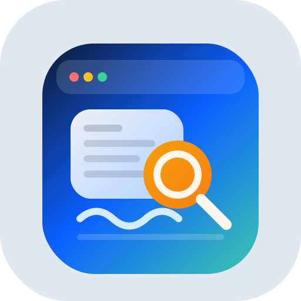
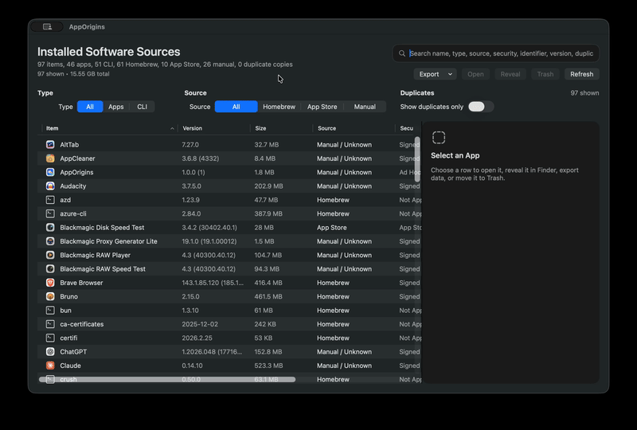

# AppOrigins [](https://visitorbadge.io/status?path=https%3A%2F%2Fgithub.com%2Fusmslm102%2Fmac-app-origins)



## Release:

[](https://github.com/usmslm102/mac-app-origins/releases)


AppOrigins is a native macOS SwiftUI utility for inspecting installed software and where it came from.

It scans your installed apps and Homebrew packages, then surfaces:

- source: `Homebrew`, `App Store`, or `Manual / Unknown`
- install type: app bundle or CLI tool
- version
- size
- duplicate installs
- signing status
- path and bundle identifier

## Demo



## Features

- Scan `/Applications` and `~/Applications`
- Optional external-volume scanning (`/Volumes/*/Applications`, opt-in)
- Detect Homebrew casks and formulae
- Detect App Store installs when possible
- Show version, size, source, location, security status, bundle ID, and path
- Sort by item, version, size, source, security status, type, and duplicates
- Search across name, source, location, security status, version, duplicate status, size, bundle ID, and path
- Filter by install type and source tabs
- Filter to external installs only
- Choose quick refresh (cached metadata) or full rescan
- Show total size for the current filtered result set
- Detect duplicate installed app copies and filter to duplicates only
- Open apps, reveal them in Finder, open locations in Terminal, copy path/identifier, or move app bundles to Trash
- Export the current view as CSV or JSON

## Requirements

- macOS 13 or later
- Xcode or Swift Package Manager

Optional tools:

- `brew` for richer Homebrew detection
- `mas` for richer App Store detection

The app still works without these tools, but related detections will be unavailable and some items may fall back to `Manual / Unknown`.

## Quick Start

Clone the repo and run it locally:

```bash
git clone https://github.com/<your-account>/AppOrigins.git
cd AppOrigins
swift run
```

## Open in Xcode

1. Open Xcode.
2. Choose `File > Open...`.
3. Select `Package.swift`.
4. Run the `AppOrigins` scheme.

## Build a DMG

Build an unsigned local DMG:

```bash
./package-dmg.sh
```

That produces `AppOrigins.dmg` in the repo root.

You can override the version metadata if needed:

```bash
APP_VERSION=1.0.0 BUILD_NUMBER=1 BUNDLE_IDENTIFIER=com.example.AppOrigins ./package-dmg.sh
```

## GitHub Release Workflow

This repo includes an unsigned release workflow at `.github/workflows/release-unsigned.yml`.

Push a version tag:

```bash
git tag v0.1.0
git push origin v0.1.0
```

The workflow will:

- build `AppOrigins.dmg`
- generate a SHA-256 checksum
- create or update the GitHub release for that tag

## Unsigned Build Warning

The generated app and DMG are unsigned and not notarized.

macOS may warn users the first time they open the app. Typical local workarounds are:

- `Right Click > Open`
- removing quarantine after copying the app into `/Applications`

```bash
xattr -dr com.apple.quarantine /Applications/AppOrigins.app
```

## Detection Details

- `brew list --cask` is used to build the Homebrew app list
- `brew list --formula` is used to enumerate Homebrew CLI tools
- `mas list` is used when `mas` is installed
- `mdls -raw -name kMDItemAppStoreHasReceipt` is used as an App Store fallback
- `codesign -dv --verbose=4` is used to classify apps as `Signed`, `Ad Hoc`, or `Unsigned`
- recursive bundle or cellar folder size is calculated locally for each scanned item

## Notes and Limitations

- `Move to Trash` only moves the `.app` bundle. It does not remove support files from `~/Library`.
- External-volume scanning is opt-in and currently scans known app folders (`/Volumes/*/Applications`) only.
- The security column currently reflects signing state and App Store provenance. It does not perform standalone notarization verification yet.
- Duplicate detection is currently focused on app bundles, using bundle identifier first and normalized app name as a fallback.
- Homebrew and App Store matching are heuristic in some cases.
- The repo icon lives at `assets/apporigins-icon.svg`, and the app bundle icon lives at `assets/AppOrigins.icns`.
